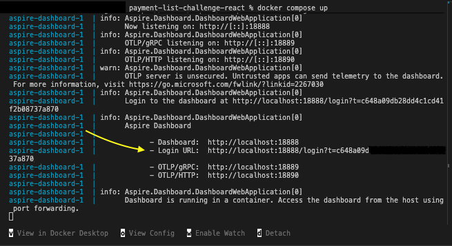
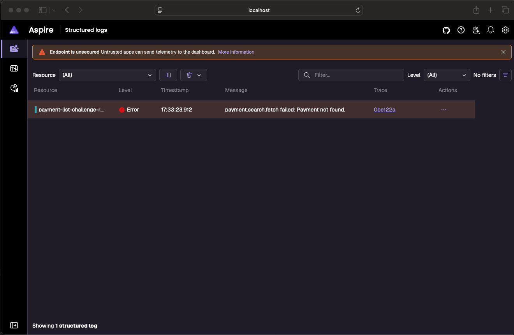

To run with the server:

```
npm run start
```

If you want to enable observability (in detached mode):

```
docker compose up
```



Example of error logs coming through otel and displayed in aspire:


To run without a server
```
npm run dev
```